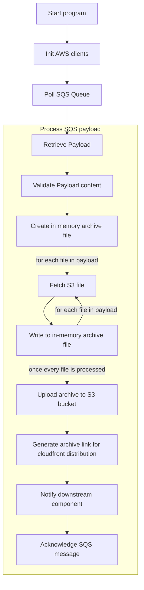

# Media Archiver

[](https://github.com/meero-com/archiver/actions/workflows/quality.yaml) [](https://github.com/meero-com/archiver/actions/workflows/ci.yaml)

Create a zip archive of several S3 files and upload it to an S3 bucket.

## Features

- Retrieve payloads from an SQS Queue
- Create a Zip archive from a list of media
- Optionally create a directory structure inside the zip
- Upload the zip file to an S3 bucket
- Notify a consumer once the archive is ready to be downloaded

### Example payload

_Note: the `.files[*].destination` field is optional._

```javascript
{
  "files": [
    {
      "source": "example-directory/uuid1.png",
      "destination": "album_1"
    },
    {
      "source": "s3://foobar/example-directory/uuid2.png",
      "destination": "album_1"
    },
    {
      "source": "example-directory/uuid3.png",
      "destination": "album_2"
    }
  ],
  "metadata" {
    "key": "value"
  }
}
```

## Runtime

Below is a table with each required and optional environment variables:

| Variable | Description | Default value |
|----------|-------------|---------------|
| `ARCHIVE_BASE_URL` | Base path for the Archive URL links. | `None` |
| `SQS_DESTINATION_QUEUE` | SQS Queue to send message to downstream consumer. | `None` |
| `SQS_SOURCE_QUEUE` | SQS Queue to retrieve payloads from | `None` |
| `S3_DESTINATION_BUCKET` | Target S3 bucket to store the archive files. | `None` |
| `S3_SOURCE_BUCKET` | Source S3 bucket that contains the media used to create the archive by default | `None` |
| `DEBUG` | Enable debug log level. | `0` |
| `DEV_MODE` | Use console rendering for logs instead of JSON rendering. | `0` |

### In AWS

This project is intended to be deployed as an ECS Service inside AWS.
It requires the following permissions:
- Interact with an SQS Queue
- Read from the source S3 bucket (media files)
- Write to the destination S3 bucket (zip archives)

It should be able to scale based on the SQS Queue's number of message.

### Local

Localstack is available through the docker-compose manifest at the top-level directory of this project.

It is currently setup to:
- Configure 2 S3 buckets (source-images, zip-storage)
- Have 2 SQS Queues (input-queue and input-queue-dlq DLQ configured for retry)

To ease configuration for local development, this projects relies on [`direnv`][direnv] which
automatically loads `.envrc` files and injects the found variables in the current environment context.

[direnv]: https://direnv.net/

In order to start the localstack container, you can run the following commands:

```console
$ cp .envrc.dist .envrc
$ docker compose up -d
$ poetry install
$ poetry run archiver
```

You can now rely on the http://localhost:4566/ endpoint with the fake credentials to
send messages in the localstack queues.


```bash
aws sqs send-message --queue-url http://localhost:4566/000000000000/input-queue \
  --endpoint-url http://localhost:4566 --message-body \
  '{ "files": [ { "source": "source.jpg", "destination": "album_1" } ], "metadata": {"user_email": "theo.massard@meero.com"}}'
```

## Processing

Below is a high level flow chart of the archiver processing.



The program has the following executive flow:
* (1) Initialize the archiver worker
  - Instantiate the SQS and S3 boto3 clients
  - Start polling messages from the SQS Queue
* (2) Process each SQS Message (polling)
  - Retrieve the message from SQS
  - Transform the payload into an easy to manipulate dataclass
  - Create an in-memory file like object used to create the zip file
  - For each file in the payload, download the s3 object and insert it in the
  zip file
  - Upload the zip file to the destination S3 bucket
  - Notify downstream consumers by sending an SQS message
  - Acknowledge the SQS message processing

## Releases

### Automated releases (CICD)

Upon adding new commits to both the `main`, the application will
get packaged as a container image.

### Manual build

```console
$ docker build -t archiver:local .
```
